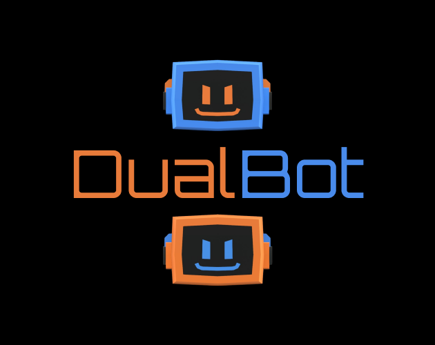
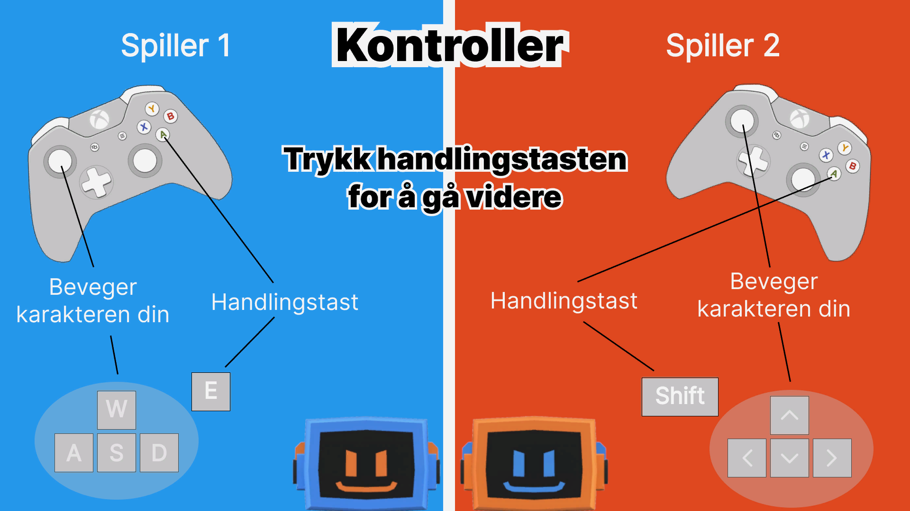
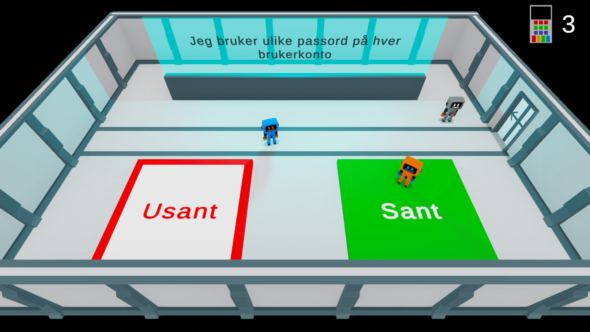
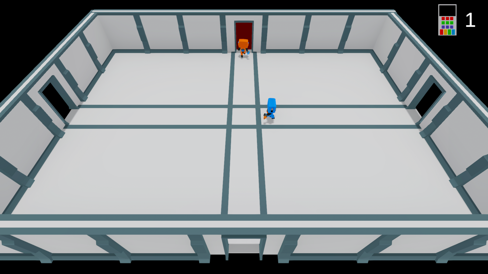

# DualBot

## Getting Started

To play DualBot, simply visit [the game page on itch.io](https://stiaaas.itch.io/dualbot) and play it in your chosen browser.

## The Game
This game was developed in Unity, as part of Stian Aasheim and Marte Træen's master's thesis in computer science at the Norwegian University of Science and Technology (NTNU), spring 2024.

DualBot is an educational cybersecurity game for two players with a focus on cooperative gameplay. It is specifically tailored to engage children and their parents in learning cybersecurity principles in a fun and interactive way.

In DualBot, players take on the roles of robots sent to help an AI research facility attacked by hackers. The robots working at the facility doesn't know right from wrong anymore and it's your task to guide and train them. Learn important cybersecurity lessons while completing fun and challenging tasks together.

## Screenshots

## Contact

If you have any questions, feedback, or suggestions, feel free to contact us at stian.aasheim98@gmail.com.
